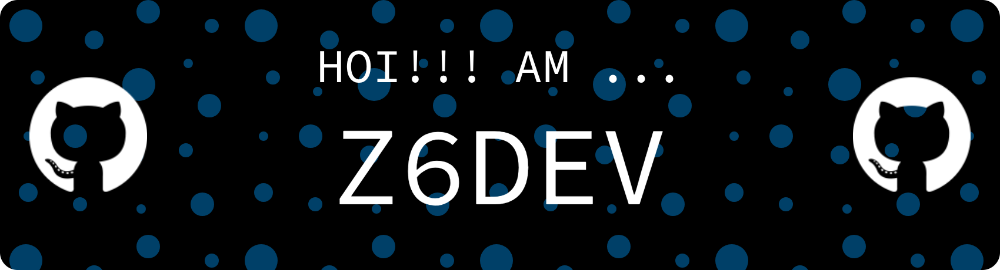

Just a **13-yo** who loves to **Code**, alas dont expect much from my code Quality.   
I also really Like **Game Development**. I made some games, like those on my Gamejolt. But you know those are **HOT GARBAGE**!!!!!  
Buuutttttt, I'm also currently working on a game Made in C!!! I hope I can finish it though.   

Oh! And I use Debian!   
so If I ever makes some stuff windows support may come later or even never. (I hope not)

---

## 🖥 Things I love:
- Game Development!!!!!!
- Making Useless Trash without Purpose. Could say most of it was scrapped after a few days.
- Graphics. For whatever reason, It just gives me a dopamine boost.

---

## ⌨ Tools I Use
- The Glorious C Language
- [Raylib](https://github.com/raysan5/raylib) (Go check it out, it's cool)
- [SDL](https://libsdl.org)

---

## 🌱 Currently Learning:
- Game Development, I am not a wizard k.
- Low-Level Stuff, I find Tinkering stuff fun.

---

## Cool People!!!!1
- [MaAlFa](https://github.com/MaAlFa123) - friend
- [si-Athaa](https://github.com/si-Athaa) - also a friend of mine

> _“Front end Web Dev is Overrated”_  
— **Z6DEV**

